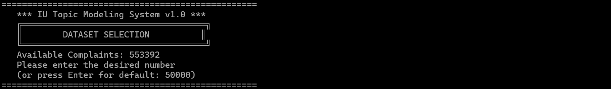
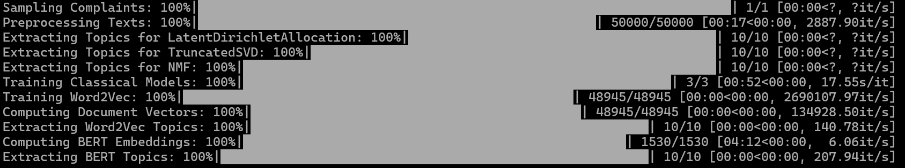
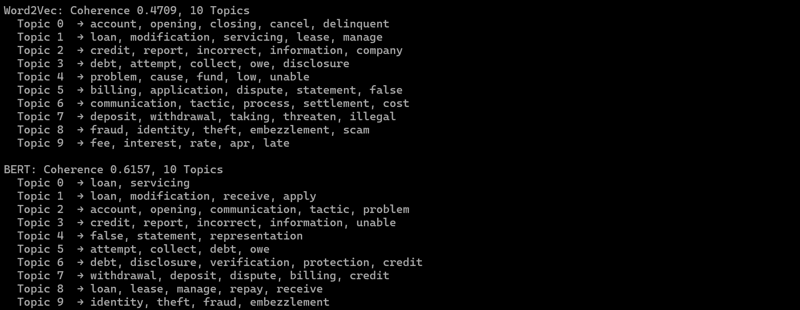
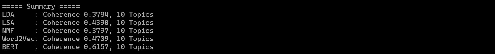
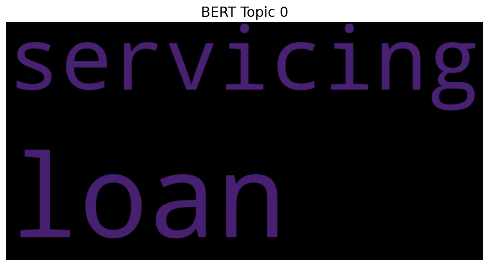

# IU_DataAnalysis-CLI

IU Topic Modeling System 1.0 with LLM Analysis

# summary

The script implements a comprehensive topic modeling system for consumer complaints, utilizing classical (LDA, LSA, NMF) and semantic (Word2Vec, BERT) models to extract themes from text data. It provides unified text preprocessing with spaCy, generates word clouds for the top models, and delivers coherence metrics alongside LLM-generated summaries of key themes. The system is user-friendly, allows dataset size selection via a CLI interface, and ensures reproducibility through fixed seeds.

# features

- Unified spaCy preprocessing (lemmatization, stopword removal).
- CLI for dataset size selection (default: 50,000).
- Topic modeling: LDA, LSA, NMF, Word2Vec, BERT.
- BoW/TF-IDF vectorization (5,000 features).
- C_v coherence scoring.
- Word cloud generation for top models.
- LLM summaries (Ollama, llama3) of top topics.
- Reproducible with seed (default: 42).
- Progress tracking with tqdm.
- KMeans clustering for semantic models.
- Detailed results and summaries output.
- CLI arguments for CSV path and seed.

# installation
- pip install numpy pandas matplotlib spacy torch gensim scikit-learn tqdm transformers wordcloud ollama
- python -m spacy download en_core_web_sm
- ollama pull llama3:latest

# start
- python analyse.py 
- for other seed then 42 use: python analyse.py --seed 22
- it uses the column 'issue'
- cuda is recommended, but not neccessary  

# bibs used

argparse
os
pathlib
random
typing
matplotlib.pyplot
numpy
pandas
spacy
torch
gensim
sklearn
tqdm
transformers
wordcloud
ollama

# screenshots
Processing

10 Topics

LLM Summary

Coherence

BERT Wordcloud

# data
Kaggle https://www.kaggle.com/datasets/kaggle/us-consumer-finance-complaints